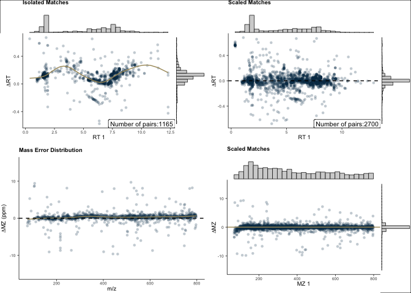

# massSight


- [Examples](#examples)
- [Description](#description)
- [Installation](#installation)
- [Data Preparation](#data-preparation)
  - [The `massSight` Object](#the-masssight-object)
- [Alignment](#alignment)
  - [`mass_combine()`](#mass_combine)
- [Results](#results)
  - [Plotting results from alignment](#plotting-results-from-alignment)
  - [Using `massSight` to annotate unknown
    metabolites](#using-masssight-to-annotate-unknown-metabolites)
- [Dev Instructions](#dev-instructions)
  - [Installation](#installation-1)

<!-- README.md is generated from README.qmd. Please edit that file -->

</a>

[](https://zenodo.org/badge/latestdoi/608216683)

`massSight` is an R package for combining and scaling LC-MS metabolomics
data.

- Citation: if you use `massSight`, please cite our manuscript: Chiraag
  Gohel and Ali Rahnavard. (2023). massSight: Metabolomics meta-analysis
  through multi-study data scaling, integration, and harmonization.
  <https://github.com/omicsEye/massSight>

## Examples

Examples and extensive documentation can be found
[here](omicseye.github.io/massSight/)

## Description

## Installation

First, if you don’t have it installed, install `devtools` using:

``` r
install.packages("devtools")
```

Then, in an `R` console, run:

``` r
devtools::install_github("omicsEye/massSight")
```

You can then load the library using:

``` r
library(massSight)
```

## Data Preparation

`massSight` works with the output of LC-MS experiments, which should
contain columns corresponding to:

1.  Compound ID
2.  Retention Time
3.  Mass to Charge Ratio
4.  (Optional) Average Intensity across all samples
5.  (Optional) Metabolite Name

| Compound_ID      |       MZ |   RT | Intensity | Metabolite             |
|:-----------------|---------:|-----:|----------:|:-----------------------|
| 1.69_121.1014m/z | 121.1014 | 1.69 |  40329.32 | 1.2.4-trimethylbenzene |
| 3.57_197.0669m/z | 197.0669 | 3.57 | 117400.93 | 1,7-dimethyluric acid  |
| 7.74_282.1194m/z | 282.1194 | 7.74 |  16491.00 | 1-methyladenosine      |
| 5.27_166.0723m/z | 166.0723 | 5.27 |  22801.91 | 1-methylguanine        |
| 5.12_298.1143m/z | 298.1143 | 5.12 |  41602.96 | 1-methylguanosine      |
| 9.58_126.1028m/z | 126.1028 | 9.58 |   3004.32 | 1-methylhistamine      |

### The `massSight` Object

`massSight` creates and uses the `MSObject` class to store data and
results pertaining to individual LC-MS experiments. Prior to alignment,
LC-MS data frames or tibbles should be converted into an `MSObject`
using `create_ms_obj`:

``` r
ms1 <-
  create_ms_obj(
    df = hp1,
    name = "hp1",
    id_name = "Compound_ID",
    rt_name = "RT",
    mz_name = "MZ",
    int_name = "Intensity",
    metab_name = "Metabolite"
  )

ms2 <-
  create_ms_obj(
    df = hp2,
    name = "hp2",
    id_name = "Compound_ID",
    rt_name = "RT",
    mz_name = "MZ",
    int_name = "Intensity",
    metab_name = "Metabolite"
  )
```

An `MSObject` provides the following functions:

- `raw_df()` to access the experiment’s raw LC-MS data
- `isolated()` to access the experiment’s isolated metabolites, which is
  important for downstream alignment tasks
- `scaled_df()` to access the experiment’s scaled LC-MS data
- `consolidated()` to access the experiment’s consolidated data
- `metadata()` to access the experiment’s metadata

``` r
ms2 |>
  raw_df() |>
  head() |>
  knitr::kable(format = "simple")
```

| Compound_ID | Metabolite      |       RT |       MZ | Intensity |
|:------------|:----------------|---------:|---------:|----------:|
| cmp.3837    | C10 carnitine   | 7.261300 | 316.2479 | 638168.92 |
| cmp.3903    | C10:2 carnitine | 7.395033 | 312.2165 |  50418.96 |
| cmp.3749    | C12 carnitine   | 7.074067 | 344.2792 | 203210.69 |
| cmp.3756    | C12:1 carnitine | 7.105283 | 342.2635 | 363021.48 |
| cmp.3682    | C14 carnitine   | 6.926967 | 372.3107 |  93491.07 |
| cmp.3705    | C14:2 carnitine | 6.993833 | 368.2792 | 235545.00 |

## Alignment

### `mass_combine()`

Alignment is performed using `mass_combine()`. This function uses a
random search to optimize the alignment parameters.

``` r
aligned <- mass_combine(
  ms1,
  ms2,
  optimize = TRUE,
  smooth_method = "gam",
  log = NULL
)
#> Optimizing parameters using known metabolites...
#> 
#> Perfect score achieved. Stopping early.
#> Optimization complete. Final score: 1.000
#> GAM smoothing for RT drift
#> Starting mass error correction
#> GAM smoothing for mass error
#> Creating potential final matches
#> Calculating match scores
```

More information on the `mass_combine()` function can be found in the
[package
documentation](https://omicseye.github.io/massSight/reference/mass_combine.html)

## Results

Results from an alignment function are stored as a `MergedMSObject`.
This object contains the following slots:

- `all_matched()`: All of the final matched metabolites between the two
  datasets. This is the main result of the various matching functions.

``` r
all_matched(aligned) |>
  head() |>
  knitr::kable()
```

| rep_Compound_ID | rep_RT | rep_MZ | rep_Intensity | rep_Metabolite | matched | Compound_ID_hp1 | Metabolite_hp1 | RT_hp1 | MZ_hp1 | Intensity_hp1 | RT_rank_1 | Compound_ID_hp2 | Metabolite_hp2 | RT_hp2 | MZ_hp2 | Intensity_hp2 | RT_adj_hp2 | MZ_adj_hp2 | RT_rank_2 | rank_diff | rt_diff | mz_diff | rank_score | rt_score | mz_score | score | delta_RT | delta_MZ |
|:---|---:|---:|---:|:---|:---|:---|:---|---:|---:|---:|---:|:---|:---|---:|---:|---:|---:|---:|---:|---:|---:|---:|---:|---:|---:|---:|---:|---:|
| 0.04_82.0533m/z | 0.04 | 82.0533 | 2.97 | NA | FALSE | 0.04_82.0533m/z | NA | 0.04 | 82.0533 | 2.97 | 0.0000000 | NA | NA | NA | NA | NA | NA | NA | NA | NA | NA | NA | NA | NA | NA | NA | NA | NA |
| 0.33_81.0706m/z | 0.33 | 81.0706 | 28.64 | NA | FALSE | 0.33_81.0706m/z | NA | 0.33 | 81.0706 | 28.64 | 0.0000712 | NA | NA | NA | NA | NA | NA | NA | NA | NA | NA | NA | NA | NA | NA | NA | NA | NA |
| 0.33_85.0290m/z | 0.33 | 85.0290 | 12.46 | NA | FALSE | 0.33_85.0290m/z | NA | 0.33 | 85.0290 | 12.46 | 0.0001425 | NA | NA | NA | NA | NA | NA | NA | NA | NA | NA | NA | NA | NA | NA | NA | NA | NA |
| 0.33_87.0322m/z | 0.33 | 87.0322 | 6.13 | NA | FALSE | 0.33_87.0322m/z | NA | 0.33 | 87.0322 | 6.13 | 0.0002137 | NA | NA | NA | NA | NA | NA | NA | NA | NA | NA | NA | NA | NA | NA | NA | NA | NA |
| 0.33_120.0808m/z | 0.33 | 120.0808 | 14.03 | NA | FALSE | 0.33_120.0808m/z | NA | 0.33 | 120.0808 | 14.03 | 0.0002850 | NA | NA | NA | NA | NA | NA | NA | NA | NA | NA | NA | NA | NA | NA | NA | NA | NA |
| 0.33_122.0477m/z | 0.33 | 122.0477 | 32.13 | NA | FALSE | 0.33_122.0477m/z | NA | 0.33 | 122.0477 | 32.13 | 0.0003562 | NA | NA | NA | NA | NA | NA | NA | NA | NA | NA | NA | NA | NA | NA | NA | NA | NA |

- `iso_matched()`: The matched isolated metabolites between the two
  datasets.

``` r
iso_matched(aligned) |>
  head() |>
  knitr::kable()
```

| Compound_ID_1 | Metabolite_1 | RT_1 | MZ_1 | Intensity_1 | Compound_ID_2 | Metabolite_2 | RT_2 | MZ_2 | Intensity_2 | delta_RT | smooth_rt | srt | mass_error_ppm | smooth_mz | smz | sintensity |
|:---|:---|---:|---:|---:|:---|:---|---:|---:|---:|---:|---:|---:|---:|---:|---:|---:|
| 0.36_75.1007m/z | NA | 0.36 | 75.1007 | 65327.30 | cmp.20 | NA | 1.012467 | 75.10054 | 256170.62 | 0.6524667 | 0.08155412 | 0.2784459 | -2.0729501 | -0.2793056 | 75.10072 | 64072.281 |
| 0.97_281.1164m/z | NA | 0.97 | 281.1164 | 3256.52 | cmp.17 | NA | 1.008017 | 281.11630 | 11176.91 | 0.0380167 | 0.08910656 | 0.8819832 | -0.3436299 | 0.2909359 | 281.11632 | 3961.192 |
| 0.99_321.1837m/z | NA | 0.99 | 321.1837 | 5565.60 | cmp.51 | NA | 1.061500 | 321.18400 | 43145.90 | 0.0715000 | 0.08949017 | 0.9017386 | 0.9443194 | 0.4784982 | 321.18355 | 13157.253 |
| 1.00_498.1935m/z | NA | 1.00 | 498.1935 | 3001.08 | cmp.50 | NA | 1.061500 | 498.19364 | 170522.74 | 0.0615000 | 0.08968693 | 0.9116163 | 0.2763986 | 0.2908606 | 498.19336 | 44626.364 |
| 1.00_512.2093m/z | NA | 1.00 | 512.2093 | 23446.89 | cmp.53 | NA | 1.070417 | 512.20940 | 975388.85 | 0.0704167 | 0.08968693 | 0.9116163 | 0.2042134 | 0.2957181 | 512.20915 | 210234.656 |
| 1.01_265.1215m/z | NA | 1.01 | 265.1215 | 8272.59 | cmp.49 | NA | 1.061500 | 265.12139 | 128848.54 | 0.0515000 | 0.08988708 | 0.9214940 | -0.4307459 | 0.2047958 | 265.12145 | 34788.183 |

### Plotting results from alignment

The `final_plots()` function returns plots containing information on RT
and MZ drift for pre isolation, isolation, and final matching results.
These plots can be used for diagnostic purposes.

``` r
plots <- final_plots(aligned)
plots
```



This plot can be saved locally using `ggsave()` from the `ggplot2`
package:

``` r
ggplot2::ggsave(
  filename = "plot.png",
  plot = plots
)
```

### Using `massSight` to annotate unknown metabolites

``` r
merged_df <- all_matched(aligned)
hp2_annotated <- merged_df |>
  dplyr::select(Compound_ID_hp2, rep_Metabolite) |>
  dplyr::inner_join(hp2, by = c("Compound_ID_hp2" = "Compound_ID"))

hp2_annotated |>
  dplyr::filter(rep_Metabolite != "") |>
  dplyr::arrange(rep_Metabolite) |>
  head(10) |>
  knitr::kable()
```

| Compound_ID_hp2 | rep_Metabolite | Metabolite | RT | MZ | Intensity |
|:---|:---|:---|---:|---:|---:|
| cmp.2157 | 1,7-dimethyluric acid | NA | 3.817950 | 197.0669 | 140175.903 |
| cmp.4168 | 1-methyladenosine | NA | 7.864050 | 282.1194 | 43167.055 |
| cmp.2810 | 1-methylguanine | NA | 5.361300 | 166.0723 | 25898.347 |
| cmp.3160 | 1-methylguanine | NA | 5.919483 | 166.0723 | 111855.470 |
| cmp.2782 | 1-methylguanosine | NA | 5.267700 | 298.1145 | 70138.717 |
| cmp.785 | 1.2.4-trimethylbenzene | NA | 1.805967 | 121.1014 | 13453.946 |
| cmp.2782 | 2-methylguanosine | NA | 5.267700 | 298.1145 | 70138.717 |
| cmp.2750 | 3-(N-acetyl-L-cystein-S-yl) acetaminophen | NA | 5.124100 | 313.0850 | 38069.497 |
| cmp.2795 | 3-(N-acetyl-L-cystein-S-yl) acetaminophen | NA | 5.316733 | 313.0850 | 7025.546 |
| cmp.4740 | 3-methylhistidine | NA | 10.289133 | 170.0923 | 490315.337 |

Here, `rep_Metabolite` is the metabolite name from the reference
dataset.

## Dev Instructions

### Installation

1.  Clone/pull `massSight`
2.  Open the R project `massSight.Rproj`
3.  Build package using `devtools::build()`
4.  Install package using `devtools::install()`
