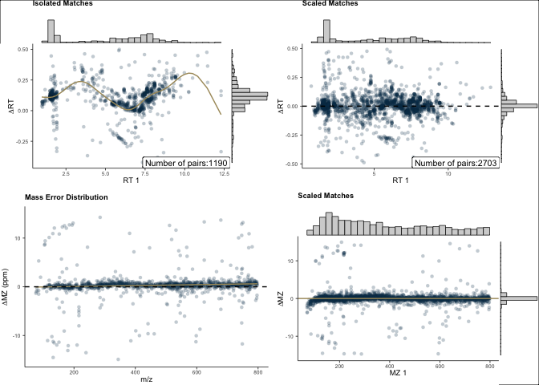

# massSight


- [Installation](#installation)
- [Input Data Format](#input-data-format)
- [Usage](#usage)
  - [1. Create massSight Objects](#1-create-masssight-objects)
  - [2. Align Datasets](#2-align-datasets)
  - [3. Access Results](#3-access-results)
  - [4. Visualize Results](#4-visualize-results)
- [Key Parameters](#key-parameters)
- [Output Format](#output-format)
- [Examples and Documentation](#examples-and-documentation)

<!-- README.md is generated from README.qmd. Please edit that file -->

</a>

[](https://zenodo.org/badge/latestdoi/608216683)

`massSight` is an R package for combining and scaling LC-MS metabolomics
data. It enables alignment and integration of metabolomics data from
multiple experiments by correcting systematic differences in retention
time and mass-to-charge ratios.

- Citation: if you use `massSight`, please cite our manuscript: Chiraag
  Gohel and Ali Rahnavard. (2023). massSight: Metabolomics meta-analysis
  through multi-study data scaling, integration, and harmonization.
  <https://github.com/omicsEye/massSight>

## Installation

``` r
pak::pak("omicsEye/massSight")
```

You can then load the library using:

``` r
library(massSight)
```

## Input Data Format

`massSight` works with LC-MS data frames that must contain the following
required columns:

1.  **Compound ID** - Unique identifier for each feature
2.  **Retention Time (RT)** - The retention time in minutes
3.  **Mass to Charge Ratio (MZ)** - The mass-to-charge ratio
4.  **Intensity** (Optional) - Average intensity across samples
5.  **Metabolite Name** (Optional) - Known metabolite annotations

Example input data format:

| Compound_ID      |       MZ |   RT | Intensity | Metabolite             |
|:-----------------|---------:|-----:|----------:|:-----------------------|
| 1.69_121.1014m/z | 121.1014 | 1.69 |  40329.32 | 1.2.4-trimethylbenzene |
| 3.57_197.0669m/z | 197.0669 | 3.57 | 117400.93 | 1,7-dimethyluric acid  |
| 7.74_282.1194m/z | 282.1194 | 7.74 |  16491.00 | 1-methyladenosine      |
| 5.27_166.0723m/z | 166.0723 | 5.27 |  22801.91 | 1-methylguanine        |
| 5.12_298.1143m/z | 298.1143 | 5.12 |  41602.96 | 1-methylguanosine      |
| 9.58_126.1028m/z | 126.1028 | 9.58 |   3004.32 | 1-methylhistamine      |

## Usage

### 1. Create massSight Objects

First, convert your LC-MS data frames into `MSObject`s using
`create_ms_obj`:

``` r
ms1 <- create_ms_obj(
    df = hp1,
    name = "hp1",
    id_name = "Compound_ID",  # Column name for compound IDs
    rt_name = "RT",           # Column name for retention time
    mz_name = "MZ",           # Column name for mass-to-charge ratio
    int_name = "Intensity",   # Column name for intensity (optional)
    metab_name = "Metabolite" # Column name for metabolite names (optional)
)

ms2 <- create_ms_obj(
    df = hp2,
    name = "hp2",
    id_name = "Compound_ID",
    rt_name = "RT", 
    mz_name = "MZ",
    int_name = "Intensity",
    metab_name = "Metabolite"
)
```

### 2. Align Datasets

Use `mass_combine()` to align the datasets. The function offers two main
approaches:

#### A. Automatic Parameter Optimization (Recommended)

``` r
aligned <- mass_combine(
    ms1,                    # Reference dataset
    ms2,                    # Dataset to align
    optimize = TRUE,        # Enable automatic parameter optimization
    smooth_method = "gam",  # Method for drift correction
    n_iter = 50            # Number of optimization iterations
)
#> Optimizing parameters using Bayesian optimization...
#> Initializing optimization...
#> 
#> Target score achieved! Stopping optimization.
#> Optimization complete. Final score: 1.000
#> 
#> Optimal parameters:
#>   RT delta: 0.962
#>   MZ delta: 15.508
#>   RT isolation threshold: 0.077
#>   MZ isolation threshold: 4.572
#>   Alpha rank: 0.076
#>   Alpha RT: -0.422
#>   Alpha MZ: -1.504
```

#### B. Manual Parameter Setting

``` r
aligned <- mass_combine(
    ms1,
    ms2,
    optimize = FALSE,
    rt_delta = 0.5,        # RT window (±minutes)
    mz_delta = 15,         # MZ window (±ppm)
    minimum_intensity = 10, # Minimum intensity threshold
    smooth_method = "gam"  # Drift correction method
)
#> GAM smoothing for RT drift
#> Starting mass error correction
#> GAM smoothing for mass error
#> Creating potential final matches
#> Calculating match scores
```

### 3. Access Results

The alignment results can be accessed in several ways:

``` r
# Get all matched features
matches <- all_matched(aligned)
# Get unique 1:1 matches
unique_matches <- get_unique_matches(aligned)
```

### 4. Visualize Results

Generate diagnostic plots to assess alignment quality:

``` r
final_plots(aligned)
```



## Key Parameters

- `optimize`: When `TRUE`, uses Bayesian optimization to find optimal
  alignment parameters
- `rt_delta`: Retention time window for matching (in minutes)
- `mz_delta`: Mass-to-charge ratio window for matching (in ppm)
- `smooth_method`: Method for drift correction (“gam”, “bayesian_gam”,
  “gp”, or “lm”)
- `match_method`: Strategy for initial matching (“unsupervised” or
  “supervised”)
- `minimum_intensity`: Minimum intensity threshold for features

## Output Format

The aligned results contain:

1.  **Matched Features**: All corresponding features between datasets
2.  **Drift Corrections**: Systematic differences in RT and MZ
3.  **Quality Metrics**: Alignment evaluation scores
4.  **Diagnostic Plots**: Visualization of RT and MZ drift

## Examples and Documentation

For more detailed examples and extensive documentation, visit our
[documentation site](omicseye.github.io/massSight/).
