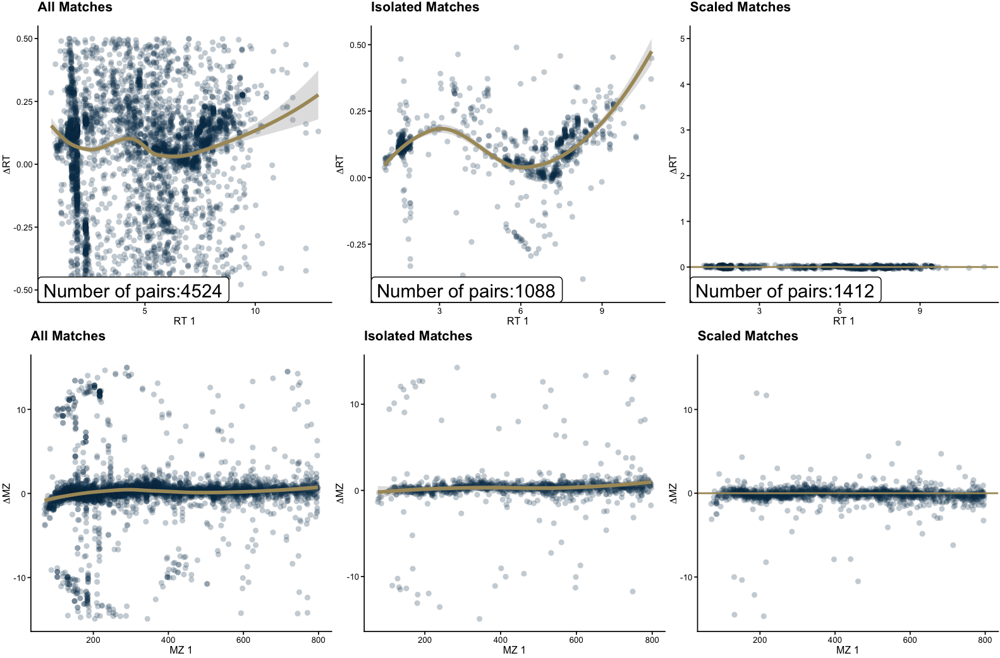

# massSight

- [Examples](#examples)
- [Description](#description)
- [Installation](#installation)
- [Data Preparation](#data-preparation)
  - [The `massSight` Object](#the-masssight-object)
- [Alignment](#alignment)
  - [`auto_combine()`](#auto_combine)
  - [`ml_match()`](#ml_match)
- [Results](#results)
  - [Plotting results from alignment](#plotting-results-from-alignment)
  - [Using `massSight` to annotate unknown
    metabolites](#using-masssight-to-annotate-unknown-metabolites)
- [Dev Instructions](#dev-instructions)
  - [Installation](#installation-1)

<!-- README.md is generated from README.qmd. Please edit that file -->

</a>

<div>

[](https://zenodo.org/badge/latestdoi/608216683)

</div>

`massSight` is an R package for combining and scaling of LC-MS
metabolomics data.

- Citation: if you use `massSight`, please cite our manuscript: Chiraag
  Gohel and Ali Rahnavard. (2023). massSight: Metabolomics meta-analysis
  through multi-study data scaling, integration, and harmonization.
  <https://github.com/omicsEye/massSight>

## Examples

Examples and extensive documentation can be found
[here](omicseye.github.io/massSight/)

## Description

## Installation

First, if you don’t have it installed, install `devtools` using:

``` r
install.packages("devtools")
```

Then, in an `R` console, run:

``` r
devtools::install_github("omicsEye/massSight")
```

You can then load the library using:

``` r
library(massSight)
```

## Data Preparation

`massSight` works with the output of LC-MS experiments, which should
contain columns corresponding to:

1.  Compound ID
2.  Retention Time
3.  Mass to Charge Ratio
4.  (Optional) Average Intensity across all samples
5.  (Optional) Metabolite Name

| Compound_ID      |       MZ |   RT | Intensity | Metabolite             |
|:-----------------|---------:|-----:|----------:|:-----------------------|
| 1.69_121.1014m/z | 121.1014 | 1.69 |  40329.32 | 1.2.4-trimethylbenzene |
| 3.57_197.0669m/z | 197.0669 | 3.57 | 117400.93 | 1,7-dimethyluric acid  |
| 7.74_282.1194m/z | 282.1194 | 7.74 |  16491.00 | 1-methyladenosine      |
| 5.27_166.0723m/z | 166.0723 | 5.27 |  22801.91 | 1-methylguanine        |
| 5.12_298.1143m/z | 298.1143 | 5.12 |  41602.96 | 1-methylguanosine      |
| 9.58_126.1028m/z | 126.1028 | 9.58 |   3004.32 | 1-methylhistamine      |

### The `massSight` Object

`massSight` creates and uses the `MSObject` class to store data and
results pertaining to individual LC-MS experiments. Prior to alignment,
LC-MS data frames or tibbles should be converted into an `MSObject`
using `create_ms_obj`:

``` r
data(hp1)
data(hp2)

ms1 <-
  create_ms_obj(
    df = hp1,
    name = "hp1",
    id_name = "Compound_ID",
    rt_name = "RT",
    mz_name = "MZ",
    int_name = "Intensity"
  )

ms2 <-
  create_ms_obj(
    df = hp2,
    name = "hp2",
    id_name = "Compound_ID",
    rt_name = "RT",
    mz_name = "MZ",
    int_name = "Intensity"
  )
```

An `MSObject` provides the following functions:

- `raw_df()` to access the experiment’s raw LC-MS data
- `isolated()` to access the experiment’s isolated metabolites, which is
  important for downstream alignment tasks
- `scaled_df()` to access the experiment’s scaled LC-MS data
- `consolidated()` to access the experiment’s consolidated data
- `metadata()` to access the experiment’s metadata

``` r
ms2 |>
  raw_df() |>
  head() |>
  knitr::kable(format = "simple")
```

| Compound_ID | Metabolite      |       RT |       MZ | Intensity |
|:------------|:----------------|---------:|---------:|----------:|
| cmp.3837    | C10 carnitine   | 7.261300 | 316.2479 | 638168.92 |
| cmp.3903    | C10:2 carnitine | 7.395033 | 312.2165 |  50418.96 |
| cmp.3749    | C12 carnitine   | 7.074067 | 344.2792 | 203210.69 |
| cmp.3756    | C12:1 carnitine | 7.105283 | 342.2635 | 363021.48 |
| cmp.3682    | C14 carnitine   | 6.926967 | 372.3107 |  93491.07 |
| cmp.3705    | C14:2 carnitine | 6.993833 | 368.2792 | 235545.00 |

## Alignment

### `auto_combine()`

Alignment is performed using `auto_combine()`

``` r
aligned <- auto_combine(
  ms1,
  ms2,
  rt_lower = -.5,
  rt_upper = .5,
  mz_lower = -15,
  mz_upper = 15,
  iso_method = "manual",
  smooth_method = "loess"
)
#> [1] "Numbers of matched/kept features: 1443"
```

More information on the `auto_combine()` function can be found in the
[package
documentation](https://omicseye.github.io/massSight/reference/auto_combine.html)

### `ml_match()`

The `ml_match()` function is an alternative method for merging LC-MS
experiments with semi-annotated data sets.

``` r
ml_match_aligned <- ml_match(
  ms1,
  ms2,
  mz_thresh = 15,
  rt_thresh = 0.5,
  prob_thresh = .99,
  seed = 72
)
```

## Results

Results from an alignment function are stored as a `MergedMSObject`.
This object contains the following slots:

- `all_matched()`: All of the final matched metabolites between the two
  datasets. This is the main result of the various matching functions.

``` r
all_matched(aligned) |>
  head() |>
  knitr::kable()
```

| df1              |   RT |       MZ |   Intensity | Metabolite                                | df2      |     RT_2 |     MZ_2 | Intensity_2 | Metabolite_2 |
|:-----------------|-----:|---------:|------------:|:------------------------------------------|:---------|---------:|---------:|------------:|:-------------|
| 7.74_282.1194m/z | 7.74 | 282.1194 |    16491.00 | 1-methyladenosine                         | cmp.4168 | 7.864050 | 282.1194 |    43167.05 |              |
| 5.27_166.0723m/z | 5.27 | 166.0723 |    22801.91 | 1-methylguanine                           | cmp.2810 | 5.361300 | 166.0723 |    25898.35 |              |
| 5.09_313.0848m/z | 5.09 | 313.0848 |    42335.94 | 3-(N-acetyl-L-cystein-S-yl) acetaminophen | cmp.2750 | 5.124100 | 313.0850 |    38069.50 |              |
| 1.94_152.0705m/z | 1.94 | 152.0705 |    83600.28 | acetaminophen                             | cmp.1435 | 2.082950 | 152.0706 |   190502.74 |              |
| 1.62_585.2701m/z | 1.62 | 585.2701 | 11502435.04 | bilirubin                                 | cmp.529  | 1.743567 | 585.2702 | 14402315.51 |              |
| 1.92_583.2546m/z | 1.92 | 583.2546 |  1393839.16 | biliverdin                                | cmp.1216 | 2.047283 | 583.2547 |  1361161.33 |              |

- `iso_matched()`: The matched isolated metabolites between the two
  datasets.

``` r
iso_matched(aligned) |>
  head() |>
  knitr::kable()
```

| df1             |   RT |      MZ | Intensity | df2      |     RT_2 |     MZ_2 | Intensity_2 |  delta_RT | smooth_rt |      srt |   delta_MZ | smooth_mz |      smz | sintensity |
|:----------------|-----:|--------:|----------:|:---------|---------:|---------:|------------:|----------:|----------:|---------:|-----------:|----------:|---------:|-----------:|
| 7.98_76.0402m/z | 7.98 | 76.0402 |  13067.16 | cmp.4356 | 8.193933 | 76.04010 |   27158.674 | 0.2139333 | 0.1129026 | 7.874778 | -0.0001027 | -3.31e-05 | 76.04023 |   7832.970 |
| 8.14_77.0799m/z | 8.14 | 77.0799 |   9291.18 | cmp.4388 | 8.283100 | 77.07982 |   11295.184 | 0.1431000 | 0.1253363 | 8.023783 | -0.0000786 | -3.23e-05 | 77.07993 |   3625.042 |
| 4.79_79.0220m/z | 4.79 | 79.0220 |   2356.37 | cmp.2649 | 4.910117 | 79.02198 |    6818.932 | 0.1201167 | 0.0954132 | 4.687141 | -0.0000210 | -3.10e-05 | 79.02203 |   2327.172 |
| 7.50_80.1318m/z | 7.50 | 80.1318 |  84942.05 | cmp.4025 | 7.635767 | 80.13173 |   11765.610 | 0.1357667 | 0.0814712 | 7.422708 | -0.0000662 | -3.03e-05 | 80.13183 |   3757.301 |
| 7.86_84.9120m/z | 7.86 | 84.9120 |  10189.64 | cmp.4247 | 8.015617 | 84.91193 |    9442.532 | 0.1556167 | 0.1041765 | 7.762498 | -0.0000657 | -2.71e-05 | 84.91203 |   3097.303 |
| 8.75_84.9605m/z | 8.75 | 84.9605 | 240071.83 | cmp.4584 | 8.978550 | 84.96037 |  287055.188 | 0.2285500 | 0.1811082 | 8.585263 | -0.0001285 | -2.70e-05 | 84.96053 |  62125.356 |

### Plotting results from alignment

The `final_plots()` function returns plots containing information on RT
and MZ drift for pre isolation, isolation, and final matching results.
These plots can be used for diagnostic purposes.

``` r
plots <- final_plots(aligned,
                     rt_lim = c(-.5, 5),
                     mz_lim = c(-15, 15))
```



This plot can be saved locally using `ggsave()` from the `ggplot2`
package:

``` r
ggplot2::ggsave(filename = "plot.png",
                plot = plots)
```

### Using `massSight` to annotate unknown metabolites

``` r
merged_df <- all_matched(aligned)
merged_df <- merged_df |>
  dplyr::mutate(
    Metabolite_2 = dplyr::case_when(
      Metabolite != "" &
        Metabolite_2 == "" ~ Metabolite,
      TRUE ~ Metabolite_2
    )
  )

hp2_annotated <- merged_df |>
  dplyr::select(contains("2")) |>
  purrr::set_names(c("df", "RT", "MZ", "Intensity", "Metabolite"))

head(hp2_annotated, 10) |>
  knitr::kable()
```

| df       |       RT |       MZ |   Intensity | Metabolite                                |
|:---------|---------:|---------:|------------:|:------------------------------------------|
| cmp.4168 | 7.864050 | 282.1194 |    43167.05 | 1-methyladenosine                         |
| cmp.2810 | 5.361300 | 166.0723 |    25898.35 | 1-methylguanine                           |
| cmp.2750 | 5.124100 | 313.0850 |    38069.50 | 3-(N-acetyl-L-cystein-S-yl) acetaminophen |
| cmp.1435 | 2.082950 | 152.0706 |   190502.74 | acetaminophen                             |
| cmp.529  | 1.743567 | 585.2702 | 14402315.51 | bilirubin                                 |
| cmp.1216 | 2.047283 | 583.2547 |  1361161.33 | biliverdin                                |
| cmp.4582 | 8.978550 | 146.1175 |   677778.63 | butyrobetaine                             |
| cmp.3837 | 7.261300 | 316.2479 |   638168.92 | C10 carnitine                             |
| cmp.3903 | 7.395033 | 312.2165 |    50418.96 | C10:2 carnitine                           |
| cmp.3749 | 7.074067 | 344.2792 |   203210.69 | C12 carnitine                             |

## Dev Instructions

### Installation

1.  Clone/pull `massSight`
2.  Open the R project `massSight.Rproj`
3.  Build package using `devtools::build()`
4.  Install package using `devtools::install()`
